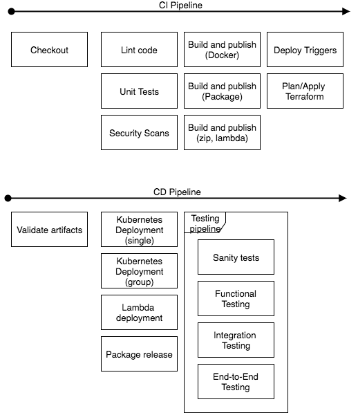
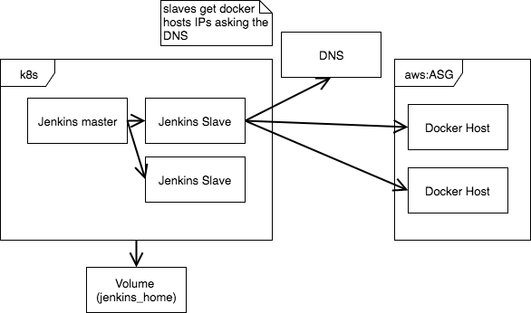

# standard-cicd-pipeline
Standard Pipeline

# Docker Images

### Jenkins Slave

Docker jenkins slave image customized to have binaries used for building and deploying.

# Kubernetes (k8s)

### Jenkins

These manifests deploy a jenkins master and two slaves.

Some manual configuration has to be made to connect the slave nodes.

# Terraform

In this dir you will find script to create a cluster of docker daemons.
This daemons use the Container Linux AMI and is configured to expose dockerd in tcp.
Instances are managed by an ASG.

Manual steps:
-  Configure an A record to point to the instances. Jenkins jobs will get the
IPs from here to connect to a cluster instance.

# Vars

Shared Library for jenkins standar pipelines.

# CI CD Pipeline modules

# Architecture Diagram for jenkins-dockerds

# References

-   [Continuous Integration Pipeline Technical Specification](https://docs.google.com/document/d/1QeNk6OREJXRZTiz7Fq46wh3gRA-dA6O9VeqRybrtdXc/edit)
-   [jenkins-jobs-as-service-py](https://phabricator.wizeline.com/diffusion/28/)
-   [docker-images](https://github.com/wizeline/docker-images)
-   [docker-base-images](https://github.com/wizeline/docker-base-images)
-   [DevOps Roadmap - Engineering Tools & Standards](https://wizeline.atlassian.net/wiki/spaces/DFS/pages/185630724/DevOps+Roadmap+-+Engineering+Tools+Standards)
